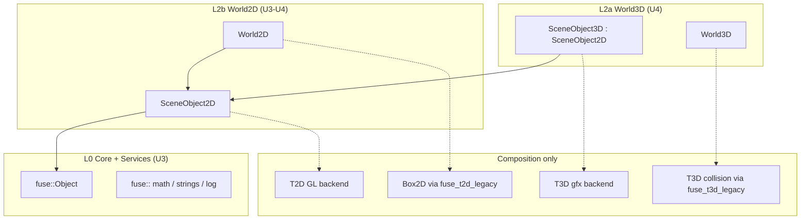

# FUSE U0 — Merge Strategy: 2D→3D Extension (Selective)

**Phase:** U0 Inventory & collision map  
**Date:** 2026-09-15  
**Status:** **Stakeholder direction** — architecture decision recorded; **not implemented** in U0  
**Related:** [symbol-collision-report.md](./symbol-collision-report.md), [subsystem-matrix.md](./subsystem-matrix.md), [unified-layout.md](./unified-layout.md)

---

## 1. Decision summary

FUSE will pursue an **intelligent source merge** — not a filesystem merge of `Engine/source` and `third_party/Torque2D/engine/source`, and **not** addon `Engine/` merges.

Where Torque DNA is genuinely shared (console/sim identity, spatial hierarchy, reflection), lift a **single greenfield hierarchy** under `Source/FUSE/` with **3D extending 2D** via inheritance.

Where subsystems are honestly different (physics backends, render paths, net stacks), use **composition** and **dual legacy backends** behind FUSE facades — never inheritance across dimension boundaries.

**Rationale:** U0 found near-duplicate `SimObject` / `ConsoleObject` hierarchies in both trees ([symbol-collision-report.md](./symbol-collision-report.md) — 19 `Sim*` class collisions, identical `SimObject` declarations). Perpetual dual hierarchies tax every feature module (AI, FX, cinematics). Selective 2D→3D extension grows one product type tree instead of two forever.

---

## 2. Class sketch (target greenfield)

All types live in `fuse::` — implemented under `Source/FUSE/Core/` and `Source/FUSE/World2D/` / `World3D/`. Legacy `SimObject` / `SceneObject` / `SceneObject2D` remain in quarantined libs until adapters retire them.

```cpp
namespace fuse {

// L0 — lifted from shared Torque DNA (console/sim/math/util collisions)
class Object;                    // identity, name, parent/child, flags, reflection hooks
class ObjectRef;                 // handle-based ref (Track A P4)

// L2b base — 2D scene membership
class SceneObject2D : public Object {
    // xy transform, layer, sort key, 2D bounds (AABB2)
    // 2D scene graph membership
    // scripting / inspector reflection (shared with 3D)
};

class World2D;                   // owns 2D scene root — NOT a physics world subclass

class Camera2D : public SceneObject2D { /* ortho, zoom, follow */ };

// L2a extension — 3D adds depth/orientation on honest 2D base
class SceneObject3D : public SceneObject2D {
    // adds: z, full orientation (quat), 3D AABB
    // 3D render hook (composition — see §4)
    // 3D collision hook (composition — see §4)
};

class World3D;                   // owns 3D zone/scene root — composes physics backend

class Camera3D : public SceneObject3D { /* perspective, FOV, etc. */ };

// U4 dimension API (prestarter §9)
class IDimension {
    virtual void tick(FrameCtx&) = 0;
    virtual void render(FrameCtx&) = 0;
};

} // namespace fuse
```

**Equivalent pattern:** If `Camera3D : Camera2D` is cleaner for shared pan/zoom behaviour, document the equivalent — the rule is **3D extends 2D where nesting is semantically honest**, not that every 3D type must inherit one fixed 2D base.

---

## 3. Where 3D extends 2D (inheritance — preferred)

Apply **only** where a 3D entity is legitimately “a 2D scene object plus depth”:

| Domain | 2D base | 3D extension | Notes |
|--------|---------|--------------|-------|
| Object identity | `fuse::Object` | (same root) | Replaces dual `SimObject` over time via adapters |
| Scene placement | `SceneObject2D` | `SceneObject3D` | xy + layer/sort shared; z + quat added |
| Cameras | `Camera2D` | `Camera3D` | Shared follow/ortho concepts where applicable |
| Scene roots | `World2D` | `World3D` | Parallel world types; **not** `World3D : World2D` unless world API truly subtypes |
| Picking / selection | `Pickable2D` mixin or `SceneObject2D` | `SceneObject3D` | Editor + runtime identity |
| Script reflection | `Object` reflection hooks | inherited | Single inspector schema path (U6) |

**Extraction sources (U3–U4):** Colliding types from [symbol-collision-report.md](./symbol-collision-report.md) — `SimObject`, `SimGroup`, `SimSet`, `ConsoleObject` registration patterns, math types (`Point2F`, `Point3F`, `MatrixF`) into `fuse_core` / shared services first, then scene types.

---

## 4. Where NOT to inherit (composition / dual backends)

| Domain | Policy | Anti-pattern |
|--------|--------|--------------|
| **Physics** | `World2D` **composes** Box2D (via `fuse_t2d_legacy`); `World3D` **composes** T3D collision (via `fuse_t3d_legacy`) | `World3D : Box2DWorld`, `SceneObject3D : b2Body` |
| **Graphics** | Dual render backends until U4 hybrid compositor / Track B RHI; `SceneObject2D/3D` hold **render component refs**, not GL/D3D base classes | `SceneObject3D : T3D::SceneObject`, forcing T2D GL under T3D gfx |
| **Networking** | `fuse::services::net` facade; legacy `GameConnection` / `NetConnection` underneath per dimension | `GameConnection3D : GameConnection2D` |
| **Audio** | `fuse::services::audio` mixer; legacy sfx/audio backends | Inheritance across mixers |
| **Gui (product)** | Qt 6 `fuse_editor` only | Any Gui* merge |
| **Legacy engines** | `fuse_t3d_legacy`, `fuse_t2d_legacy` static libs — wrapped, not subclassed in-place | Physical merge of `Engine/source` + T2D `engine/source` |

---

## 5. Do / don't table

| Do | Don't |
|----|-------|
| Extract shared duplicates (console/sim/math/util) into `Source/FUSE/Core` + `Services` | Merge addon `Engine/` trees into `Engine/` |
| Implement `SceneObject2D` / `SceneObject3D` greenfield under `Source/FUSE/World2D`, `World3D/` | Physically marry `Engine/source` and `third_party/Torque2D/engine/source` in one directory |
| Use temporary **adapters** (`legacy::t3d::SceneObject` → `fuse::SceneObject3D`) during strangler | Link raw dual `SimObject` definitions in one binary |
| Prefer **replace-over-time**: new hierarchy becomes source of truth; legacy shrinks | Big-bang delete legacy before U8 parity |
| Apply 3D-extends-2D only where nesting is **honest** | Subclass Box2D worlds, GL devices, or net connection types for “unification” |
| Compose physics/render/net behind handles on `SceneObject*` | Force T2D GL pipeline as base class of T3D renderer |

---

## 6. Intelligent source-merge policy (five rules)

1. **Extract shared duplicates** identified in [symbol-collision-report.md](./symbol-collision-report.md) (console, sim, math, util) into `Source/FUSE/Core` and `Source/FUSE/Services` — **single implementation**, `fuse::` namespaces.

2. **Do not merge** addon `Engine/` trees into FUSE `Engine/` ([addon-ore-catalog.md](./addon-ore-catalog.md)).

3. **Do not physically marry** `Engine/source` and `third_party/Torque2D/engine/source`. Strangler path: new hierarchy in `Source/FUSE/`; legacy wrapped as `fuse_t3d_legacy` / `fuse_t2d_legacy` until replaced ([unified-layout.md](./unified-layout.md)).

4. **Prefer greenfield** `SceneObject2D` / `SceneObject3D` that **replaces** dual legacy types over time. Temporary adapters at the legacy boundary are expected (U2–U4).

5. **Subsystem matrix** updated: sim/objects leans **Merge / Replace** toward shared 2D-base hierarchy; physics/gfx/net remain **Keep dual** (composition).

---

## 7. Sequencing vs U2–U4

| Phase | Merge strategy activity |
|-------|-------------------------|
| **U0** (now) | Document decision; no code moves |
| **U1** | Umbrella CMake; optional `Source/FUSE/Core/` stub — no scene types yet |
| **U2** | One-process smoke: `fuse_core` init + both legacy libs prefixed; **no** unified `SceneObject3D` required for gate |
| **U3** | Extract `fuse::Object`, math, strings, logging, reflection from collision report; begin `SceneObject2D` skeleton; adapters to legacy `SimObject` |
| **U4** | `SceneObject3D : SceneObject2D`; `World2D` / `World3D` + `IDimension`; hybrid compositor composes render backends (not inheritance); demo: 2D sprite + 3D clear |
| **U5+** | Feature modules (`fuse_ai`, etc.) target `fuse::SceneObject2D/3D` agents; legacy script compat via adapters |
| **U8** | Legacy scene types deprecated for new content; compat path for imported `.mis` / T2D modules |



---

## 8. Impact on other U0 deliverables

| Document | Change |
|----------|--------|
| [subsystem-matrix.md](./subsystem-matrix.md) | Sim/objects → Merge/Replace toward 2D-base hierarchy; console/reflection aligned |
| [unified-layout.md](./unified-layout.md) | `World2D/Scene/`, `World3D/Scene/` paths; inheritance direction |
| [risk-register.md](./risk-register.md) | R16 — inheritance misuse across physics/gfx |
| [symbol-collision-report.md](./symbol-collision-report.md) | Unchanged (evidence); strategy consumes its findings |

---

## 9. Gate U0 checklist item

- [x] Stakeholder merge strategy documented
- [ ] U3+ implementation of `fuse::Object` / `SceneObject2D` / `SceneObject3D` — not started

**Explicit non-goals in U0:** No `Engine/` file moves, no addon merges, no C++ implementation of this hierarchy in this PR.
